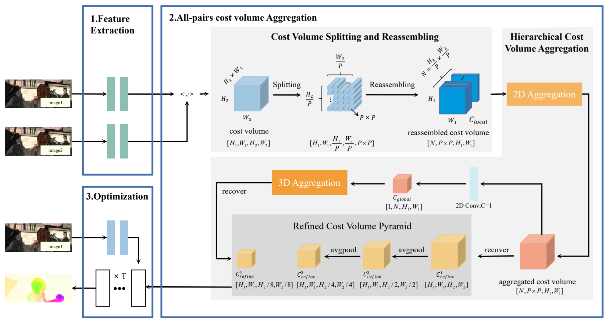
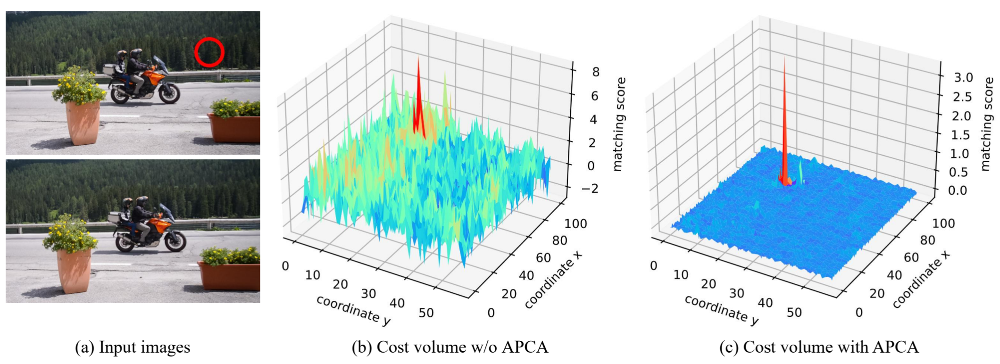

# APCAFlow (TMM)

This repository contains the source code for our paper:

[APCAFlow: All-Pairs Cost Volume Aggregation for Optical Flow Estimation](https://ieeexplore.ieee.org/abstract/document/10494553?casa_token=5ReHPkmVqKgAAAAA:y4pdLKoDqJuIveUgiF6E_faLIYv1byfvsWDMznihjtB4CJ8FDDBYHP1ApB05q_CUYVISN6BoBesB)<br/>
Miaojie Feng, Hao jia, Zengqiang Yan, Xin Yang





[//]: # (## Comparision)

## Requirements

```
conda create -n APCAFlow python=3.7
conda activate APCAFlow
conda install pytorch==1.10.0 torchvision==0.11.0 torchaudio==0.10.0 cudatoolkit=11.3 -c pytorch -c conda-forge
pip install opencv-python
pip install scikit-image
pip install tensorboard
pip install tqdm
pip install timm==0.5.4
```

## Required Data

To evaluate/train APCAFlow, you will need to download the required datasets.

* [FlyingChairs](https://lmb.informatik.uni-freiburg.de/resources/datasets/FlyingChairs.en.html#flyingchairs)
* [FlyingThings3D](https://lmb.informatik.uni-freiburg.de/resources/datasets/SceneFlowDatasets.en.html)
* [Sintel](http://sintel.is.tue.mpg.de/)
* [KITTI-2012](https://www.cvlibs.net/datasets/kitti/eval_stereo_flow.php?benchmark=flow)
* [KITTI-2015](https://www.cvlibs.net/datasets/kitti/eval_scene_flow.php?benchmark=flow)
* [HD1K](http://hci-benchmark.iwr.uni-heidelberg.de/)

## Evaluation

Pretrained models can be downloaded from [google drive](https://drive.google.com/drive/folders/1zPzfvJVYkeszDFTFOa5wXHgqLPlMiPx2?usp=drive_link).

To evaluate on FlyingChairs, run

```
CUDA_VISIBLE_DEVICES=0 python evaluate.py --model checkpoints/apca-chairs.pth --dataset chairs
```

## Training

To train on FlyingChairs, run

```
sh train_chairs.sh
```

To train on FlyingThings, run

```
sh train_things.sh
```

To train on Sintel, run

```
sh train_sintel.sh
```

To train on KITTI, run

```
sh train_kitti.sh
```

## Submission

For submission to the KITTI benchmark, run

```
python create_kitti_submission_tile.py
```

For submission to the Sintel benchmark, run

```
python create_sintel_submission.py
```

## Citation

If you find our work useful in your research, please consider citing our paper:

```
@article{feng2024apcaflow,
  title={APCAFlow: All-Pairs Cost Volume Aggregation for Optical Flow Estimation},
  author={Feng, Miaojie and Jia, Hao and Yan, Zengqiang and Yang, Xin},
  journal={IEEE Transactions on Multimedia},
  year={2024},
  publisher={IEEE}
}
```

## Contact

Please feel free to contact me (Miaojie) at fmj@hust.edu.cn.

## Acknowledgements

This project is heavily based on [RAFT](https://github.com/princeton-vl/RAFT)), We thank the original authors for their excellent work.


